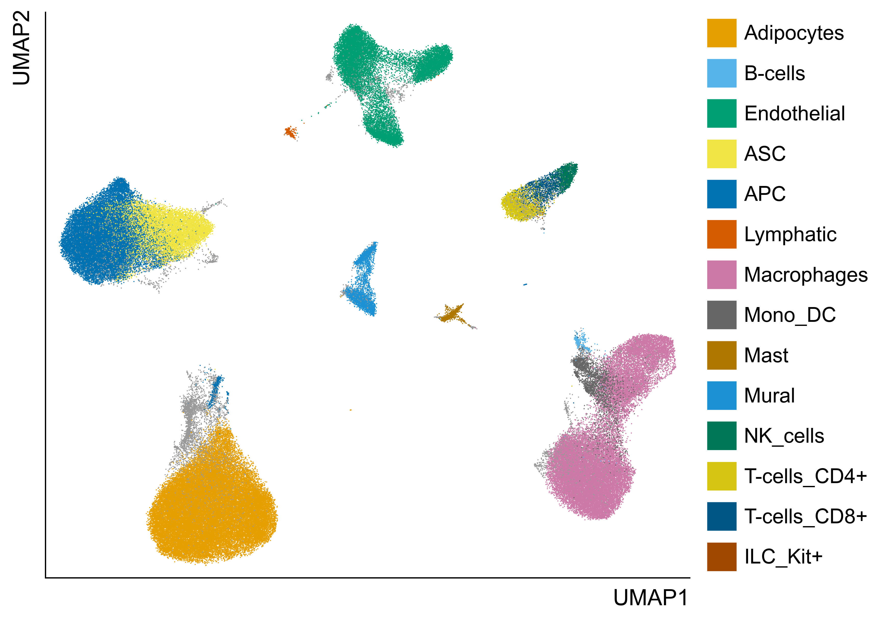
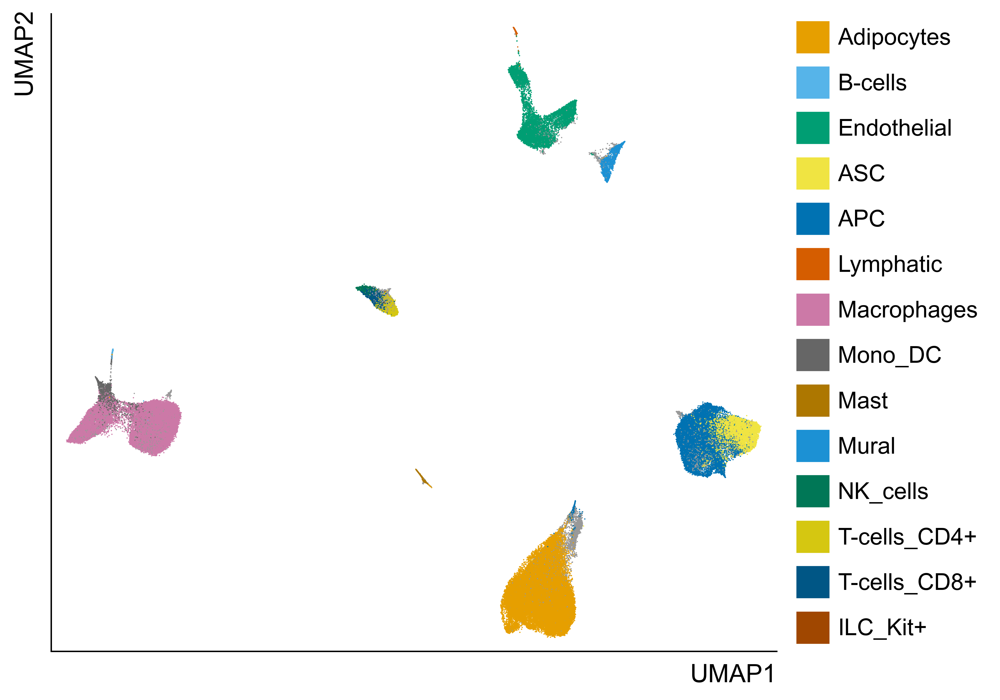
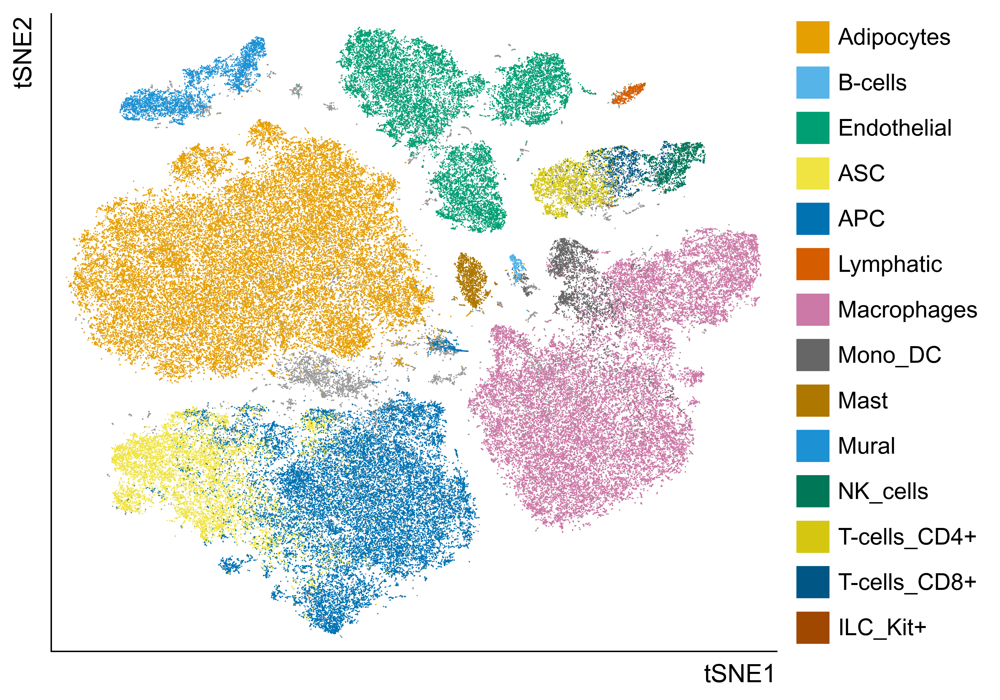
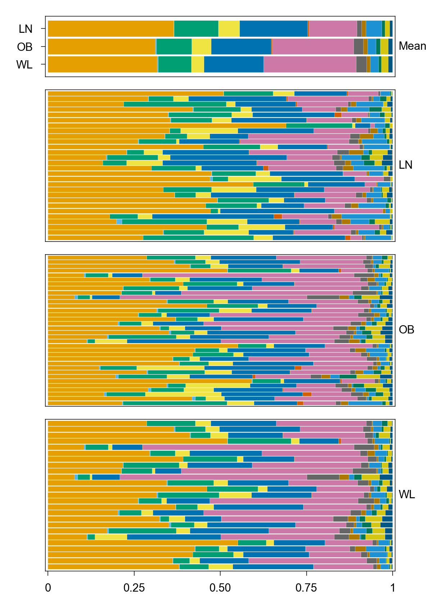
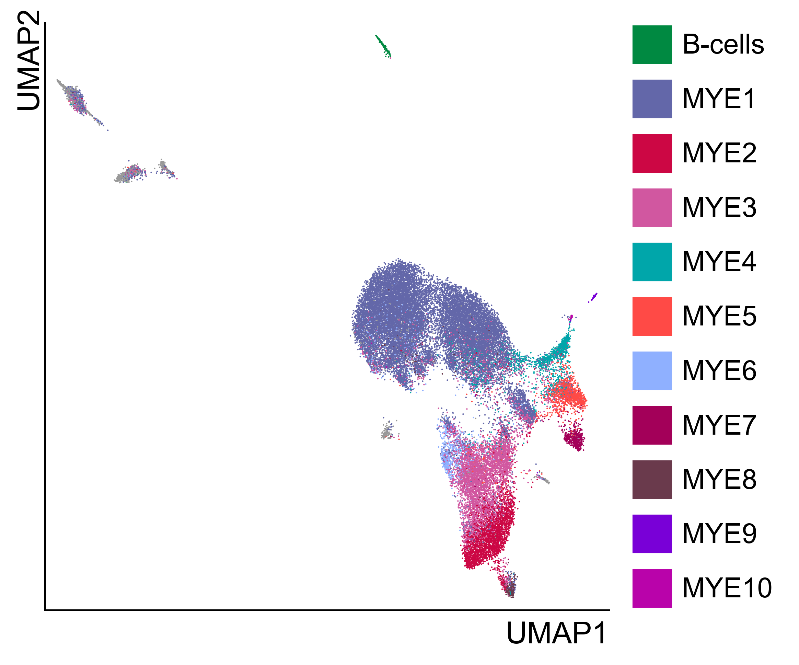
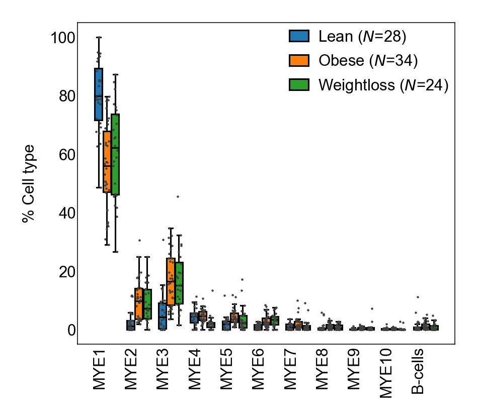
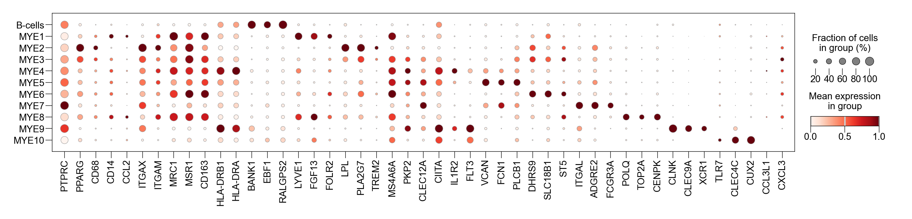
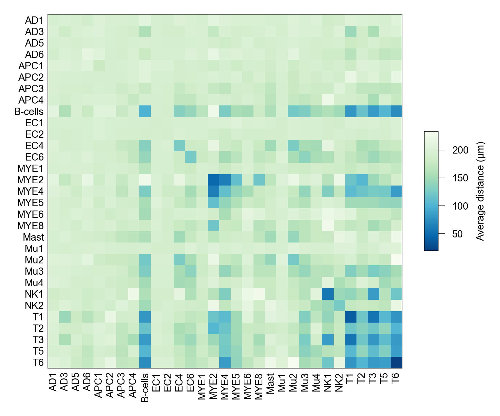
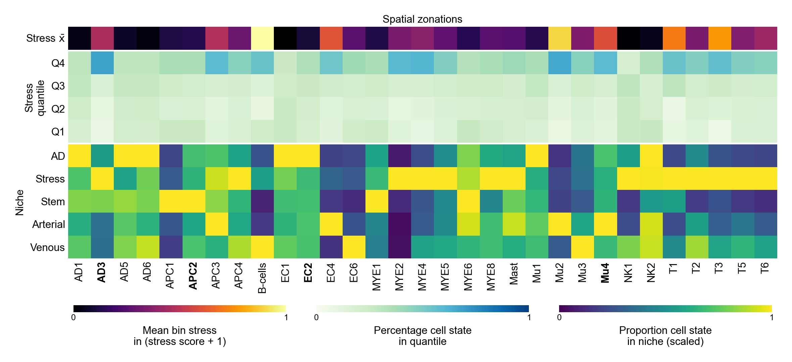

<div align="center">
  <h1>Selected reproduction of single-cell adipose niche remodelling analyses from Miranda et al., Nature, 2025.</h1>
</div>

A selective reproduction/reimplementation of adipose niche remodelling analysis from the following publication:
```bibtex
@article{Miranda2025Selective,
  title        = {Selective remodelling of the adipose niche in obesity and weight loss},
  author       = {Miranda, A.M.A., McAllan, L., Mazzei, G. et al.},
  journal      = {Nature},
  year         = {2025},
  doi          = {10.1038/s41586-025-09233-2},
}
```

This repository is a small exercise intended to build familiarity with a common single-cell software stack. These are reimplementations of selected downstream analyses from Miranda et al. with an emphasis on reproducibility. 

Each analysis can be run via a single CLI entry point, results are deterministic, and figures are generated programmatically to publication-quality standard.

<br>

## Installation
```sh
# Create environment. Optionally update pip tooling
conda create -n adipose_atlas python=3.11 -y
conda activate adipose_atlas
python -m pip install -U pip setuptools wheel

# Install package
git clone <INSERT_AFTER_PUSH>
cd adipose_atlas
pip install -e ".[dev]"
```
<br>

## Data requirements

Download the released AnnData objects (global_integrated_scp_lite.h5ad and xenium_nuclei_segmentation_scp.h5ad) that are linked [here](https://github.com/WRScottImperial/WAT_single_cell_analysis_Nature_2024?tab=readme-ov-file).

<br>

## Analyses

### 1) Global atlas embedding
Reproduction of the paper's global single-cell atlas embedding (**Fig. 1c**). I attempted to reproduce the workflow using exact params as described in [the associated repo](https://github.com/WRScottImperial/WAT_single_cell_analysis_Nature_2024/blob/13a804f563789313b92b77935c271776b4c4cfba/single-nuc/clustering/global_clustering_and_integration.py#L332):

```
Raw counts → normalize to 10K → log1p normalization → regress out → subset to HVG → PCA → Harmony → BBKNN
```
But the [results were not interpretable](docs/_static/umap_cell_type_umap.png). I approximated a more standard pipeline following [Huemos et al.](https://www.nature.com/articles/s41576-023-00586-w), generating the figure from adata.raw.X. I worked off the implication that the count matrices were already filtered or low reads, low complexity, high mito or ribo fractions, and doublet nuclei as mentioned in the methods. The pipeline is implemented as below:


```
Raw counts → normalize to 10k → log1p normalization → subset to HVG → regress out → scale → PCA → Harmony → neighbors
```
The cell type proportion figure is a reproduction of (**Fig. 1d**). I opted to color the projection according to the cell states provided from the original paper as opposed to re-running leiden clustering due to the differences discussed above. The entry point is:
```sh
adipose_atlas global_atlas_embedding --config configs/global_atlas_embedding.yaml
```

<div align="center">
<table style="width:100%; margin:auto; border-collapse:collapse;">
  <tr>
    <th style="text-align:center; width:50%;">UMAP (precomputed from X_pca)</th>
    <th style="text-align:center; width:50%;">UMAP (recomputed from adata.raw.X)</th>
  </tr>
  <tr>
    <td style="text-align:center;">
      
    </td>
    <td style="text-align:center;">
      
    </td>
  </tr>
  <tr>
    <th style="text-align:center; width:50%;">t-SNE (recomputed from adata.raw.X)</th>
    <th style="text-align:center; width:50%;">Cell type proportion</th>
  </tr>
  <tr>
    <td style="text-align:center;">
      
    </td>
    <td style="text-align:center;">
      
    </td>
  </tr>
</table>
</div>
<br>

### 2) Myeloid state analysis
Reproduction of some of the paper's analysis on myeloid state. As the data used for the LAM subtype clustering is not available, I opted for **Fig. 2a**, UMAP after re-integration and reclustering of myeloid subtypes, **Extended Data Fig. 2a**, a dotplot of myeloid cell-state markers, and **Extended Data Fig. 2c**, myeloid cell type abundance across conditions.

For the re-integration, we use the same pipeline as above, and for the same reason, opt to forgo leiden re-clustering in favor of using the paper's cell state labels.
```sh
adipose_atlas myeloid_state_analysis --config configs/myeloid_state.yaml
```
<div align="center">
<table style="width:100%; margin:auto; border-collapse:collapse;">
  <tr>
    <th style="text-align:center; width:50%;">Myeloid UMAP (recomputed from adata.raw.X)</th>
    <th style="text-align:center; width:50%;">Myeloid state abundance by condition</th>
  </tr>
  <tr>
    <td style="text-align:center;">
      
    </td>
    <td style="text-align:center;">
      
    </td>
  </tr>
</table>
</div>
<br>
<table style="width:85%; margin:auto">
<tr>
<th style="text-align:center">Myeloid marker gene dotplot</th>
</tr>
<tr>
<td style="text-align:center"></td>
</tr>
</table>
<br>

### 3) Spatial analyses
Reproduction of some spatial analyses with data derived from the 10X Xenium platform. I reproduced **Fig. 4G**, which plots stress scores and niche composition across cell states to show which states are found in high-stress spatial zones, and **Extended Data Fig. 8d** which plots the average distance between cell states.
```sh
adipose_atlas spatial_analysis --config configs/spatial_analysis.yaml
```
<div align="center">
<table style="width:100%; margin:auto; border-collapse:collapse;">
  <tr>
    <th style="text-align:center; width:50%;">Spatial proximity between cell states</th>
    <th style="text-align:center; width:50%;">Spatial stress zonation by cell state and niche (recomputed from adata.raw.X)</th>
  </tr>
  <tr>
    <td style="text-align:center;">
      
    </td>
    <td style="text-align:center;">
      
    </td>
  </tr>
</table>
</div>